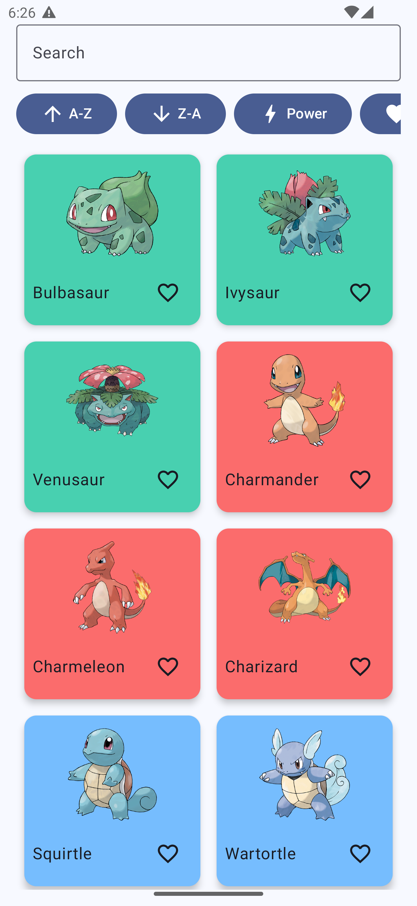
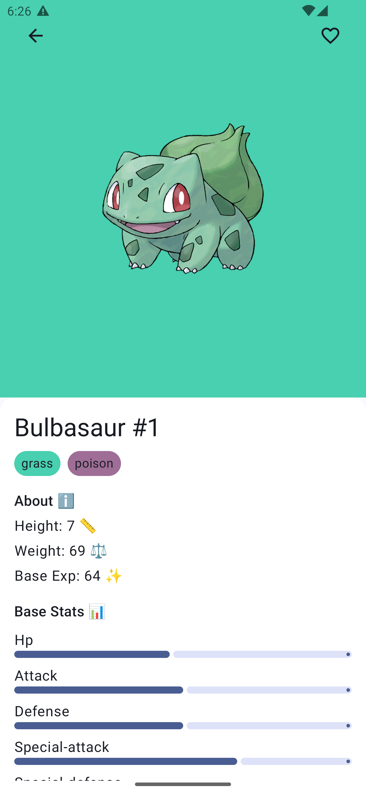

# Pokémon App 🚀

A modern Android application built with Jetpack Compose to explore Pokémon data. It fetches information from the public [PokeAPI](https://pokeapi.co) service.

## Features ✨
- Browse the first generation of Pokémon (151 creatures) with modern UI
- Advanced search by name and sort by different criteria (A-Z, Z-A, Power, Favorites)
- View detailed statistics, types and evolution chain with proper error handling
- Mark favorites for quick access with intuitive UI feedback
- Modern Material 3 design with dynamic colors (Android 12+)
- Robust error handling and loading states
- Offline-friendly architecture with proper state management
- Accessibility support with content descriptions

## Architecture & Modern Features 🏗️
- **Modern State Management**: Uses `StateFlow` and `UiState` patterns for robust UI state handling
- **Error Handling**: Comprehensive error handling with `Result` types and user-friendly error messages
- **Loading States**: Proper loading indicators and skeleton screens
- **Material 3 Design**: Latest Material Design guidelines with dynamic theming
- **Accessibility**: Proper content descriptions and keyboard navigation support
- **Clean Architecture**: Repository pattern with proper separation of concerns
- **Kotlin Best Practices**: Modern Kotlin features including coroutines, sealed classes, and type-safe builders

## API 🔗
The app uses **PokeAPI**, an open REST API that provides Pokémon details, species information and evolution data. All requests are made via HTTPS using Ktor with proper error handling and retry mechanisms.

## Tech Stack 🛠
- **Kotlin** (1.9.25) with modern language features
- **Jetpack Compose** (1.5.11) for modern Android UI with Material 3
- **Ktor** (3.0.1) HTTP client for robust network operations
- **Koin** (4.0.0) for dependency injection
- **Coil** (2.7.0) for efficient image loading with caching
- **Coroutines** (1.9.0) for asynchronous programming
- **StateFlow** for reactive state management
- **Result** types for type-safe error handling
- Build system modernized with **Gradle** (8.13) and **Android Gradle Plugin** (8.5.2)

## Getting Started ▶️
1. Clone the repository
2. Open the project in Android Studio Giraffe or later
3. Sync the project and let Gradle download dependencies
4. Run on a device or emulator (minSdk 26, targetSdk 35)
5. Enjoy exploring the Pokémon world with modern Android development patterns!

## Recent Modernizations 🔄
- **Updated Dependencies**: All dependencies updated to latest stable versions
- **Enhanced Error Handling**: Robust error handling with user-friendly messages and retry functionality
- **Improved State Management**: Modern reactive state management with proper loading and error states
- **Material 3 Theming**: Updated to latest Material Design with dynamic colors
- **Better Architecture**: Clean separation of concerns with repository pattern and proper abstraction
- **Enhanced Accessibility**: Improved content descriptions and navigation support
- **Performance Optimizations**: Better memory management and network request handling

## CI/CD Pipeline 🔄
The project includes automated continuous integration workflows using GitHub Actions:

- **Android CI**: Runs on every push and pull request to main/master branches
  - Builds the project with Gradle
  - Runs lint checks for code quality
  - Executes unit tests
  - Uploads build reports on failure
  - Generates debug APK on success

- **PR Build Check**: Runs on every pull request
  - Verifies the build assembles successfully
  - Runs unit tests to ensure code quality
  - Performs lint analysis
  - Automatically comments on PRs with build status
  - Uploads lint reports for review

These workflows ensure code quality and prevent broken builds from being merged into the main branch.

## Screenshots 📷

### Home Screen 🏠

A simple list of Pokémon with search. 🐉

### Detail Screen 📋

Detailed Pokémon information with evolutions. ⚡